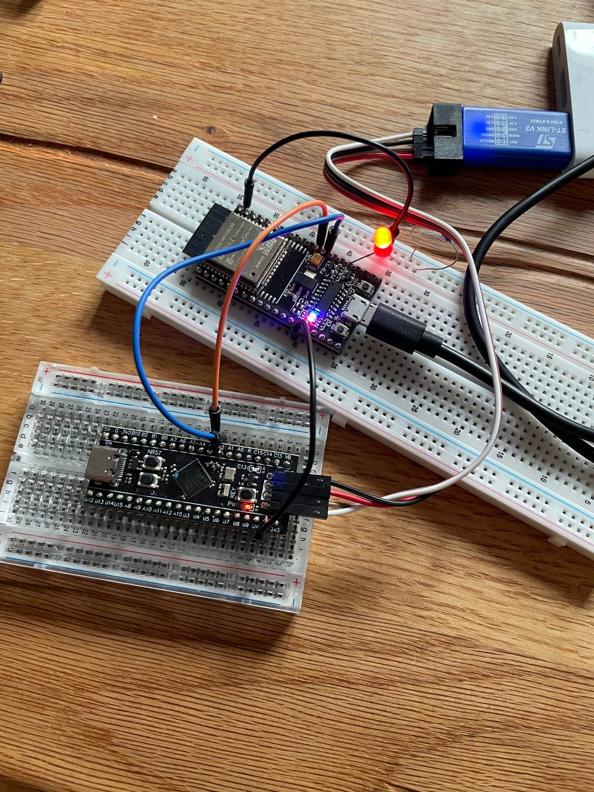

# STM32F401 ↔ ESP32 UART Button-to-LED

## Image
  

## Overview
**UART communication** between an **STM32F401CCU6** microcontroller and an **ESP32** development board.

- A **push button** on the STM32 (PA0) is used as input.  
- When pressed, the STM32 sends a text message (`BTN: PA0 pressed`) over **USART2 (115200 baud)**.  
- The ESP32 receives this message and toggles its onboard **LED (GPIO2)**. 

---

## 🔌 What is UART?
**UART** stands for **Universal Asynchronous Receiver/Transmitter**.  
It is a very common way for two devices to talk to each other using just **two wires**:

- **TX (Transmit)**: sends data out  
- **RX (Receive)**: receives data in  

Key facts:
- UART is **asynchronous** → no clock line is shared. Both devices must agree on the **baud rate** (bits per second).  
- Common baud rates: 9600, 115200, etc.  
- Data is sent **frame by frame**:  
  - 1 start bit (`0`)  
  - 8 data bits (like a character `'A'`)  
  - 1 stop bit (`1`)  
  - Optional parity bit (error check)  

For example, at **115200 baud** each bit is ~8.68 µs long.  
So the STM32 can send `"BTN: PA0 pressed\r\n"` and the ESP32 reconstructs it on the other side.

---

## Hardware Required
- STM32F401CCU6 board (Black Pill)  
- ESP32 DevKit (ESP32-WROOM or similar)  
- Push button + jumper wires  
- USB cables for both boards  
- Common ground between STM32 and ESP32  

---

## Wiring

| STM32 Pin | Function        | ESP32 Pin | Notes               |
|-----------|----------------|-----------|---------------------|
| PA2       | USART2_TX      | GPIO16    | STM32 → ESP32 data  |
| PA3       | USART2_RX      | GPIO17    | ESP32 → STM32 data (optional) |
| GND       | Ground         | GND       | Must be common      |
| PA0       | Button input   | —         | Button between PA0 and GND 
---

## STM32 Code (Bare-metal C)

### Steps inside the code

1. **Clock Configuration**  
   - Enable clock for GPIOA (`RCC_AHB1ENR`)  
   - Enable clock for USART2 (`RCC_APB1ENR`)

2. **GPIO Setup (PA2, PA3 for USART2)**  
   - `GPIOA_MODER`: set PA2 and PA3 to **Alternate Function mode (10)**  
   - `GPIOA_AFRL`: select **AF7** (USART2) for PA2 and PA3  
   - `GPIOA_OSPEEDR`: set PA2, PA3 to **high speed**  
   - `GPIOA_PUPDR`: enable **pull-up on PA3 (RX)**  

3. **GPIO Setup (PA0 as Button)**  
   - Configure PA0 as **input**  
   - Enable **internal pull-up resistor**  
   - Button connects PA0 → GND → pressed = logic `0`  

4. **USART2 Setup**  
   - Disable USART (`CR1=0`)  
   - Configure baud rate via helper function `usart_brr_from()`  
     - Formula ensures correct baud at 16 MHz system clock  
   - Enable **Transmitter (TE)** and **Receiver (RE)**  
   - Enable USART (`UE`)  

5. **Main Loop**  
   - Poll PA0 for press (active low).  
   - On press (with debounce):  
     - Send string `"BTN: PA0 pressed\r\n"` via `usart2_write_str()`  
   - Wait for button release before next toggle.

---

## ESP32 Code (Arduino IDE)

### Steps inside the code

1. **Setup**  
   - Initialize USB Serial (`Serial`) at 115200 baud (debug output to PC).  
   - Initialize `Serial2` at 115200 baud, pins RX=16, TX=17 (UART connection to STM32).  
   - Configure LED pin (GPIO2) as output, start LOW.  

2. **Loop**  
   - **handleFromSTM32()**  
     - Reads incoming characters from STM32.  
     - Builds a line until `\n`.  
     - If line is `"BTN: PA0 pressed"`, toggles LED state.  
     - Prints status to Serial Monitor.  
   - **handleFromPC()**  
     - Forwards any text typed in Serial Monitor to STM32 (optional debugging).  

3. **Result**  
   - Every press of STM32 button → LED toggles ON/OFF on ESP32.  
   - Debug messages show both STM32 lines and LED status.

---

## How to Build & Run

### STM32 (Bare-metal C)
1. Copy the `main.c` into your STM32CubeIDE or bare-metal GCC project.  
2. Make sure system clock is left at **16 MHz HSI** (default).  
3. Compile and flash to STM32F401CCU6.  
4. Connect UART pins to ESP32 as described.

### ESP32 (Arduino IDE / PlatformIO)
1. Open Arduino IDE.  
2. Select **ESP32 Dev Module**.  
3. Copy the ESP32 sketch (`ESP32-Code/UART-LED-control.ino.ino`).  
4. Upload to ESP32.  
5. Open Serial Monitor @ 115200 baud.  

---

## Serial Monitor Example

When pressing STM32 button:
```
[STM32] BTN: PA0 pressed
[ESP32] LED is now ON

[STM32] BTN: PA0 pressed
[ESP32] LED is now OFF
```

---

## License
MIT License
